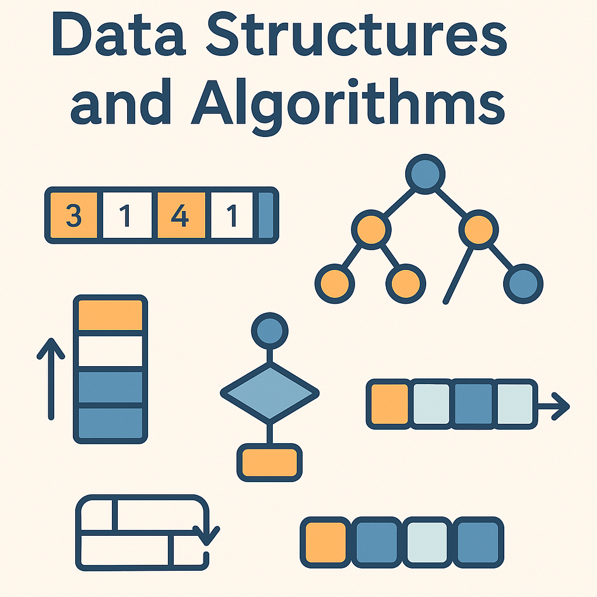

## Introduction
This repositry contains a collection of common data structures and algorithms implemented in c++ and python. 

The rendered version of the website, contained in `docs/`, uses github pages and can be viewed using the following  [link](https://marcovolino.github.io/data-structures-and-algorithms/)

## Contributors
- Marco Volino
