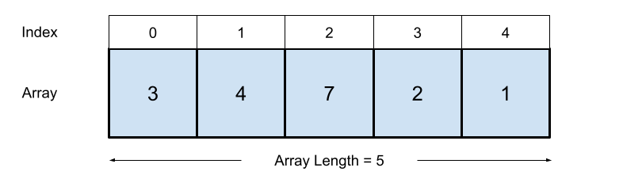

An **array** is a data structure that stores elements in a fixed-size, contiguous block of memory, as illustrated below. Each element in the array is of the same data type and can be accessed directly using an index, typically starting from zero. 
Arrays allow fast access to elements but have fixed size, meaning resizing requires the creation of a new array. 
They are ideal for storing ordered data like lists of numbers, characters, or objects.
However, inserting or deleting elements in the middle can be costly since it may require shifting elements. 




### Interface

Arrays should implement the following functionality: 

- Indexing, or accessing, elements 
- Insertion (beginning, middle, end)
- Deletion 
- Updating values
- Traversal (looping through an array).
 
Features and implementations vary across programming languages. 

In this [code](https://github.com/marcovolino/data-structures-and-algorithms/blob/main/c%2B%2B/data-structures/DynamicArray.cpp), a templated dynamically allocated array is implemented from scratch.

### Complexity

- An array is O(n) space complexity, where n is the number of elements
- Access operations are O(1) time complexity - generally implemented using pointer arithmetic.
- Update operations are O(1) time complexity
- Insert operations are O(n) time complexity
- Delete operations are O(n) time complexity


## Arrays in C++
Arrays can be implemented in c++ using the following `[]` notation, as shown below:

```c++
// Declare Array
int myArray[5] = {3,4,7,2,1};

// Access element with operator[]
std::cout << myArray[0] << std::endl;

---
Output: 3
---

// get size of array
std::cout << "myArray contains " << sizeof(myArray)/sizeof(int) << " elements" << std::endl;

---
Output: myArray contains 5 elements
---
```

The C++ Standard Template Library also includes an [std::array](https://en.cppreference.com/w/cpp/container/array) data structure, which is a static array. 

```c++
// Declare Array
std::array<int,5> myArray = {3,4,7,2,1};

//Access element with operator[]
std::cout << myArray[0] << std::endl;

---
Output: 3    
---

// Get size of array
std::cout << "myArray contains " << myArray.size() << " elements" << std::endl;

---
Output: myArray contains 5 elements
---
```

The C++ Standard Template Library also includes a [std::vector](https://en.cppreference.com/w/cpp/container/vector) data structure, which is a dynamically-sized array.

```c++
// Declare Array
std::vector<int> myArray = {3,4,7,2,1};

//Append element
myArray.push_back(5);

//Access element with operator[]
std::cout << myArray[0] << std::endl;

---
Output: 3    
---

// Get size of array
std::cout << "myArray contains " << myArray.size() << " elements" << std::endl;

---
Output: myArray contains 5 elements
---
```


## Arrays in python

Python does not have a built-in array class object, but a (List)[https://docs.python.org/3/tutorial/datastructures.html] can be used instead, which contains a rich set of functions as demonstrated below.


```python
# Declare Array 
myArray = [3,4,7,2,1]
    
# Access element
print(myArray[0])

# get length of array
print("myArray contains " + str(len(myArray)) + " elements")

Output: myArray contains 5 elements
```
    
In python, Lists also include functions to `append()` and `extend()`

```python
# Declare Array 
myArray = [3,4,7,2,1]

# Append element
myArray.append(5)

# Print Array contents
print(myArray)

---
Output: [3,4,7,2,1,5]
---
```

Arrays can also be appended to array

```python
# Declare Array 
myArray = [3,4,7,2,1]

# Declare second array 
myArray2 = [6,8]

# Append myArray2 to myArray 
myArray.append(myArray2)

# Print Array
print(myArray) 

---
Output:  [3,4,7,2,1,[6,8]]
---
```

Here we have appended myArray2 as an element within myArray. 
This occurs as python uses dynamic typing, where object types are determined at runtime. 
In contrast C++ uses static typing where the type of every variable must be known at compile time.


Here the `extend()` function is used to correctly append the elements of myArray2 to myArray

```python
# Declare Array 
myArray = [3,4,7,2,1]

# Declare second array 
myArray2 = [6,8]

# Append myArray2 to myArray 
myArray.extend(myArray2)

# Print Array
print(myArray) 

----------
Output:  [3,4,7,2,1,5,6,8]
----------
```

## Summary
Arrays are a core data structure offering fast access and predictable memory usage. 
- In C++, use arrays, `std::array`, or `std::vector` depending on whether you need fixed or dynamic size.
- In Python, lists function as dynamic arrays with rich built-in methods like `append()` and `extend()`.
