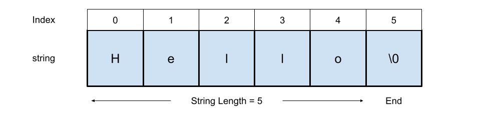

A string is a sequence of characters used to represent text, which can include letters, numbers, symbols, and spaces. 
Strings in C++ and python are typically enclosed in quotes e.g., `""` or `''`. 
Strings are one of the most commonly used data structures in programming used for tasks like displaying messages, processing input, or manipulating text. 
Strings support operations like concatenation, slicing, searching, and formatting. 
Under the hood, a string is often implemented as an [array](/data-structures/arrays) of characters with a special end marker or length field, see figure below. 
In some languages, such as python, strings are immutable, meaning their contents cannot be changed after creation. 



### Interface

Common methods that should be implemented by a string class are: 
  
- Length - return the length of the string
- Access char - access the individual characters of a string  
- Concatenate - join two strings together  
- Substring - return part, or a substring, of a string   
- Replace - replace part of a string      
- Exists in string - check if a character or string exists within a string     

### Complexity

- A string has O(n) space complexity, where n is the number of characters
- Accessing a character of a string has O(1) time complexity - just like an array!
- Concatenation is O(n) time complexity
- Getting a substring is O(k) time complexity, where k is the length of the substring.


## Strings in C++
In C++, a string can be defined using C-style syntax `char[]` or using the Standard Template Library (STL) `std::string`, which is prefered due to the rich functionality built into the STL.  


Using the `char[]` syntax, a string can be defined and printed as follows:
```c++
//include iostream for output
#include <iostream>

// declare string
char str[] = "Hello";

// print string
std::cout << str << std::endl;

Output: Hello

// print string element
std::cout << str[3] << std::endl;

Output: l

```

Using the modern `std::string` class, a string can be declared as follows:
```c++
//include iostrem for output
#include <iostream>

// include string header
#include <string>

// declare string
std::string myString = "Hello";

// print string
std::cout << myString << std::endl;

Output: Hello
```

The function `length()` can be used to return the length of a string, you can also use `size()`.
```c++
// declare string
std::string myString = "Hello";

// get length of string 
std::cout << myString.length() << std::endl;

Output: 5
```

Concatenation of strings can be achieved using the `+ operator`.
```c++
// declare strings
std::string myString1 = "Hello";
std::string myString2 = "World";

// Concatanate
std::string myString3 = myString1 + myString2;

// Print
std::cout << myString3 << std::endl;

Output: HelloWorld
```

C++ has a wide range of built-in functions that support many types of string manipulation. 

Here we see an example of using the `substr()` function, which requires the first index and length as input.
```c++
// declare strings
std::string myString = "Hello";

// get substring
std::string myStringSub =  myString.substr(1,3);

// Print
std::cout << myStringSub << std::endl;

Output: ell
```

Finally 

```c++
// initialise strings
std::string myString1 = "Hello World, this is my String";
std::string myString2 = "is";

// use the find() function to check if a substring is present
bool isFound = myString1.find(myString2) != std::string::npos;

// verifying the result
if (isFound)
{
    // myString2 is within myString1
    std::cout << "Substring Found" << std::endl;
}
else
{
    // myString2 is NOT within myString1
    std::cout << "Substring not Found" << std::endl;
}
```


## Strings in python
```python
# Declare string 
myString = "Hello"
    
# print string
print(myString)

Output: Hello

# print string character
print(myString[1])

Output: e

# Note, this operation is invalid as strings are immutable in python
myString[0] = 'w'

print(len(myString))

Output: 5
```    

Example of Concatenation using the `+ operator`
```python
# Declare string 
myString1 = "Hello"
myString2 = "World"

# Concatenate Strings
myString3 = myString1 + myString2

# Print
print(myString3)

Output: HelloWorld
```

Here is an example of getting a substring
```python
# Declare string 
myString = "Hello"

# get substring using [] notation
mySubString = myString[1:4]

# Print result
print(mySubString)

Output: ell
```

Here is an example of replacing part of a string
```python
# Declare string 
myString = "Hello, here is my String"

# 
myReplacedString = myString.replace("Hello","Goodbye")

# Print result
print(myReplacedString)

Output: Goodbye, here is my String
```

Here is an example of checking if a string contains another string
````python
# Declare string 
myString1 = "Hello, here is my String"
myString2 = "here"

# find first instace of
firstIndex = myString1.find(myString2)

# myString1 contains myString2
if firstIndex!=-1:

    # Print message
    print("myString1 contains myString2 starting at " + str(firstIndex))

# myString1 does not contain myString2 
else:
    # Print message
    print("myString1 does not contain myString2")
    
Output: myString1 contains myString2 starting at 7
````

## Summary
Strings may look simple, but they have depth — from encoding to performance. 
- Python makes strings beginner-friendly and flexible.
- C++ gives you more control, but also more responsibility - it is generally always best to use `std::string` over `char[]`.
- In Python, strings are immutable—you cannot modify them after creation. In contrast, C++ std::string allows modifications like replacing or appending characters.
