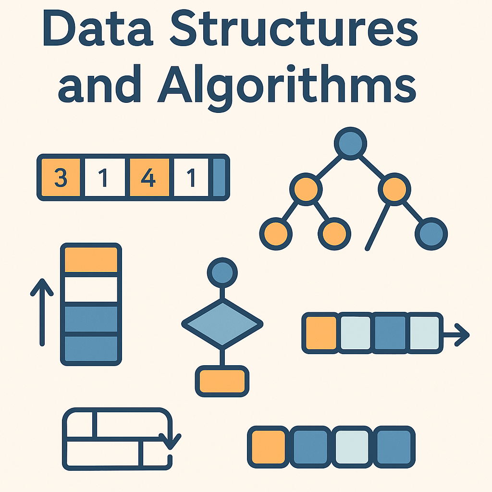

## Welcome
This website documents the theory and implementation of common data structures and algorithms useful for programming problems. Example implementations can be found in the [code repository](https://github.com/marcovolino/data-structures-and-algorithms).

##  Contents
#### Key Concepts
- [Data Structures](concepts/data-structures) - TODO
- [Alogrithms](concepts/algorithms) - TODO
- [Complexity](concepts/complexity) - TODO

#### Data Structures
- [Arrays](data-structures/arrays)  
- [Strings](data-structures/strings) - TODO 
- [Queue]() - TODO
- [Stack]() - TODO
- [Linked Lists]() - TODO 

#### Algorithms
- [Bubble Sort](algorithms/bubblesort) - TODO

